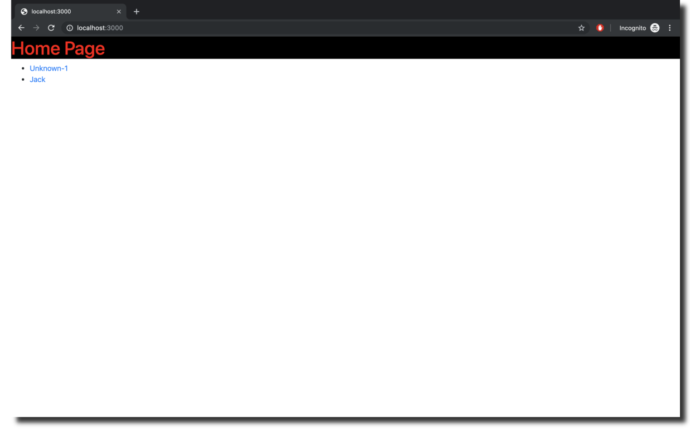

# Result-Web

This project is the web application working on Django framework. The project is display the result from [ML2_face_emoji_recognition](https://github.com/dacharat/face_emotion_result/tree/master/face_emoji_recognition) as a line graph. User also can record the graph on this website.

## Project setup
1. Install [Docker](https://docs.docker.com/install/) and [Docker Compose](https://docs.docker.com/compose/install/).
2. Download Docker PostgreSQL volume from [this link](https://drive.google.com/drive/folders/1eYmj7gX7XQvMt_RxRCY2ho-FL5UmqWHZ?usp=sharing) and place the `data` floder in this directory. 
3. run `docker-compose up -d` to start the containers of database and website.

## Create Database
Before start using this project, you must create a database with name `my_face_data` for Django can connect to it. By follow this step:
1. run docker images: `docker-compose up -d`
2. access to PostgreSQL shell : `docker exec -it my_postgres psql -U postgres`
3. in the PostgreSQL shell tying a SQL command to create a database: `CREATE DATABASE "my_face_data";` 


## If you don't have Docker Compose!!
- Use `docker run -d -p 54320:5432 --volume ~/dev/py3_keras/django-face-emotion-data/data:/var/lib/postgresql/data --name my_postgres postgres:11` to create PostgreSQL container.
- Edit `DATABASES` in `mysite/settings.py` from
```
DATABASES = {
    'default': {
        'ENGINE': 'django.db.backends.postgresql_psycopg2',
        'NAME': 'my_face_data',
        'USER': 'postgres',
        'HOST': 'my_postgres',
        'PORT': '5432',
    }
}
```
to
```
DATABASES = {
    'default': {
        'ENGINE': 'django.db.backends.postgresql_psycopg2',
        'NAME': 'my_face_data',
        'USER': 'postgres',
        'HOST': 'lcoalhost',
        'PORT': '54320',
    }
}
```
- run Django server: `python manage.py runserver 0.0.0.0:3000`



## Other useful command
#### Docker:
- `docker exec -it my_postgres psql -U postgres`: to access psql shell. [See postgreSQL command](#postgresql)
- `docker exec -it django_web bash`: to access website bash. [See Django command](#django)

#### PostgreSQL:
- `\l` to see list of database
- `\c my_face_data` to use database name `my_face_data`(databasee for this website)
- `\dt` to see list of table of the used database
- `select face from test_person;` example of query command
- `\q` to quit psql shell

#### Django:
- `django-admin.py startproject mysite .` to create this project
- `python manage.py makemigrations` check diffent to database 
- `python manage.py migrate` migrate the change to database
- `python manage.py shell` open django shell
- `python manage.py createsuperuser` create user for admin page
- `python manage.py startapp graph` create new model name `graph`
- `python manage.py inspectdb` see all table in database